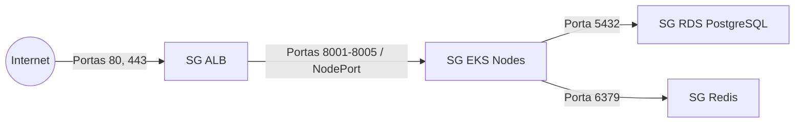

# 📋 Inventário de Infraestrutura e Estimativa de Custos AWS

> **Projeto:** ToogleMaster (FIAP Tech Challenge - Fase 3)  
> **Arquitetura:** 3-Tier Enterprise Network (Pública, Aplicação Privada, Dados Isolados) + Shared ECR Layer  
> **Orquestração:** Terragrunt (v1.1.1) + Terraform (v1.13.3 / AWS Provider ~> 5.0)  
> **Região AWS Padrão:** `us-east-1` (N. Virginia)

---

## 🏛️ 1. Arquitetura de Redes & Separação de Camadas (Stacks)

A infraestrutura é dividida em **2 camadas operacionais independentes** para máxima flexibilidade e economia:

1. **🌟 Camada Compartilhada e Persistente (`environments/shared/ecr`):**  
   Os 5 repositórios ECR são criados uma única vez e nunca são destruídos ao derrubar os ambientes, garantindo que as imagens Docker permaneçam salvas.
2. **🔄 Camada Efêmera de Runtime (`environments/dev`):**  
   Contém a rede 3-Tier, EKS, bancos RDS e caches, que podem ser criados e destruídos a qualquer momento para zerar os custos.

```text
VPC: 10.0.0.0/16 (tooglemaster-dev-vpc)
│
├── 🌐 TIER 1: CAMADA PÚBLICA (DMZ / Ingress)
│   ├── Subnet Pública A (us-east-1a): 10.0.1.0/24   [kubernetes.io/role/elb = "1"]
│   ├── Subnet Pública B (us-east-1b): 10.0.2.0/24   [kubernetes.io/role/elb = "1"]
│   ├── Internet Gateway (IGW)
│   ├── 1x Elastic IP (EIP)
│   └── 1x NAT Gateway (Saída de tráfego para os nós privados)
│
├── 🔒 TIER 2: CAMADA PRIVADA DE APLICAÇÃO (Compute / EKS & Cache)
│   ├── Subnet Privada App A (us-east-1a): 10.0.10.0/24  [kubernetes.io/role/internal-elb = "1"]
│   ├── Subnet Privada App B (us-east-1b): 10.0.20.0/24  [kubernetes.io/role/internal-elb = "1"]
│   ├── EKS Cluster Control Plane (v1.31)
│   ├── EKS Managed Node Group (2x t3.small EC2) - Sem IP público
│   └── ElastiCache Redis 7 (1x cache.t3.small)
│
├── 🛡️ TIER 3: CAMADA PRIVADA DE DADOS (Database - 100% Isolada)
│   ├── Subnet Isolada DB A (us-east-1a): 10.0.30.0/24  [Sem rota externa / Sem NAT]
│   ├── Subnet Isolada DB B (us-east-1b): 10.0.40.0/24  [Sem rota externa / Sem NAT]
│   ├── RDS PostgreSQL - auth-db (db.t3.small / 20GB / Single-AZ)
│   ├── RDS PostgreSQL - main-db (db.t3.small / 20GB / Single-AZ)
│   └── RDS PostgreSQL - targeting-db (db.t3.small / 20GB / Single-AZ)
│
└── 🌟 SHARED LAYER (Global / Persistente - Fora do ciclo de vida do Dev)
    └── 5x Amazon ECR Repositories (analytics, auth, evaluation, flag, targeting)
```

---

## 📦 2. Mapeamento de Recursos Provisionados

| Camada / Recurso | Identificador no Terraform | Tipo / Sizing | Ciclo de Vida |
| :--- | :--- | :--- | :--- |
| **Amazon ECR (x5)** | `environments/shared/ecr` | 5 repositórios com scan on push | **Persistente** (Criado 1x) |
| **VPC** | `module.network.aws_vpc.main` | `10.0.0.0/16` | Efêmero (`dev`) |
| **Internet Gateway** | `module.network.aws_internet_gateway.main` | - | Efêmero (`dev`) |
| **NAT Gateway** | `module.network.aws_nat_gateway.main` | 1 nó + 1 EIP | Efêmero (`dev`) |
| **Subnets Públicas (x2)** | `module.network.aws_subnet.public` | `10.0.1.0/24`, `10.0.2.0/24` | Efêmero (`dev`) |
| **Subnets Privadas (x2)** | `module.network.aws_subnet.private_app` | `10.0.10.0/24`, `10.0.20.0/24` | Efêmero (`dev`) |
| **Subnets Isoladas (x2)** | `module.network.aws_subnet.isolated_db` | `10.0.30.0/24`, `10.0.40.0/24` | Efêmero (`dev`) |
| **EKS Control Plane** | `module.eks.aws_eks_cluster.main` | Kubernetes `v1.31` | Efêmero (`dev`) |
| **EKS Worker Nodes** | `module.eks.aws_eks_node_group.main` | 2x `t3.small` (On-Demand) | Efêmero (`dev`) |
| **RDS Auth** | `module.rds.aws_db_instance.auth_db` | `db.t3.small` (20GB / Single-AZ) | Efêmero (`dev`) |
| **RDS Flag** | `module.rds.aws_db_instance.main_db` | `db.t3.small` (20GB / Single-AZ) | Efêmero (`dev`) |
| **RDS Targeting** | `module.rds.aws_db_instance.targeting_db` | `db.t3.small` (20GB / Single-AZ) | Efêmero (`dev`) |
| **ElastiCache Redis** | `module.redis.aws_elasticache_cluster.main` | `cache.t3.small` (1 nó) | Efêmero (`dev`) |
| **DynamoDB** | `module.dynamodb.aws_dynamodb_table.analytics` | On-Demand (`PAY_PER_REQUEST`) | Efêmero (`dev`) |
| **SQS** | `module.sqs.aws_sqs_queue.events` | Standard Queue | Efêmero (`dev`) |
| **IAM Roles/Policies** | `module.iam.*` | Least Privilege / Roles dedicadas | Efêmero (`dev`) |

---

## 🛡️ 3. Matriz de Segurança (Security Groups & Zero Trust)



1. **`tooglemaster-alb-sg` (Público):** Aceita tráfego HTTP (`80`) e HTTPS (`443`) de qualquer IP (`0.0.0.0/0`).
2. **`tooglemaster-eks-nodes-sg` (Privado):** Aceita tráfego **apenas** vindo do `tooglemaster-alb-sg` e comunicação interna entre Pods.
3. **`tooglemaster-rds-sg` (Isolado):** Aceita tráfego PostgreSQL (`5432`) **exclusivamente originado do `tooglemaster-eks-nodes-sg`**.
4. **`tooglemaster-redis-sg` (Privado):** Aceita conexões Redis (`6379`) **exclusivamente originado do `tooglemaster-eks-nodes-sg`**.

---

## 💰 4. Estimativa Detalhada de Custos AWS (Região `us-east-1`)

A tabela abaixo reflete a precificação oficial da AWS (On-Demand) para os recursos dimensionados no ambiente **`dev`** (`t3.small`):

| Componente | Quantidade & Especificação | Custo Horário Estimado | Custo Mensal Estimado (730h) |
| :--- | :--- | :--- | :--- |
| **EKS Control Plane** | 1 Cluster gerenciado | ~$0.10 / hora | ~$73.00 |
| **EKS Worker Nodes (EC2)** | 2x `t3.small` (2 vCPU, 2GB RAM cada) | 2 × $0.0208 = ~$0.0416 / hora | ~$30.37 |
| **NAT Gateway** | 1x Gateway compartilhado | ~$0.0450 / hora | ~$32.85 |
| **RDS PostgreSQL (Auth)** | 1x `db.t3.small` + 20GB GP3 (Single-AZ) | ~$0.0340 / hora + storage | ~$26.92 |
| **RDS PostgreSQL (Flag)** | 1x `db.t3.small` + 20GB GP3 (Single-AZ) | ~$0.0340 / hora + storage | ~$26.92 |
| **RDS PostgreSQL (Targeting)** | 1x `db.t3.small` + 20GB GP3 (Single-AZ) | ~$0.0340 / hora + storage | ~$26.92 |
| **ElastiCache Redis** | 1x `cache.t3.small` (1.37GB RAM) | ~$0.0340 / hora | ~$24.82 |
| **DynamoDB (Analytics)** | Modo On-Demand (`PAY_PER_REQUEST`) | $0.00 (Tier Gratuito / centavos) | < $0.50 |
| **SQS Queue** | Fila padrão (1 milhão reqs gratuitas/mês) | $0.00 | $0.00 |
| **ECR Repositories (Shared)** | Armazenamento de 5 imagens (~1GB total) | - | ~$0.10 |
| **S3 Remote State + Lock** | 1 Bucket S3 + Tabela de Lock DynamoDB | - | < $0.05 |
| **TOTAL GERAL ESTIMADO (Ligado 24/7):** | - | **~$0.33 / hora** | **~$242.45 / mês** |

---

### 💡 Dicas de Otimização e Economia para Testes Acadêmicos / Dev:

1. **Camada ECR Persistente:**  
   Suba o ECR uma única vez (`cd environments/shared/ecr && terragrunt apply`). Custo: ~$0.10/mês.
2. **Uso por Demanda (Pague apenas pelo tempo de teste):**  
   Ao rodar os testes da pós-graduação por **4 horas**, o custo total consumido na sua conta será de apenas **~$1.32 dólares**.
3. **Destruir o Dev após a gravação dos vídeos e testes:**  
   ```bash
   cd environments/dev
   terragrunt destroy
   ```
   Isso remove 100% dos recursos caros (EKS, RDS, NAT Gateway, Redis, EC2), zerando a fatura imediatamente e mantendo suas imagens Docker intactas no ECR!
